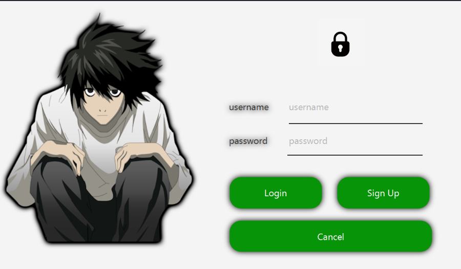

# WatchList_App

1. A desktop App where a user will get recommendations based on their preferences (taken at the time of registration) & like history.
2. Users can like and view their favourite movies using the "watchlist" feature on the sidebar
3. Users also have the option to create their personalized playlist using the "playlist" feature on the sidebar
4. Users also get to see the latest movies on the homepage.
5. Movies are fetched using TMDB API

To fetch the movie data you have to register on TMDB and generate an  api_key
Now create a package inside src/main/java named as **apiKeys**
Create a java class file inside the apiKeys package named as **Services.java**
and copy following code in that file

**Login**

1. User is supposed to enter the username and password here
2. After clicking "login", backend checks the "user" table in the database and verifies the details.

- In case, the details don't match, the following messages shows up:

- If details match, dashboard opens. (Described in a section below)

**Sign Up**
1. User Registration screen opens as soon as user hits "Sign Up" on the "Login" Screen.

2. User must fill "First Name", "Last Name", "Age", "Username", "Password" & "Confirm Password".
- Username must be unique and this is verified as soon as user clicks "Register".
- In case the username is not unique, the app does not move forward and gives a warning message.
3. As soon as user clicks "Register", backend matches the "Password" & "Confirm Password" fields & enters details into the "user" table. Then, the "Select Genre" screen opens.

4. Backend inserts a record in the "genre" table to keep track of genre ratings (which influence the feed) when user clicks "Submit".

**Dashboard**
1. Home page of the dashboard fetches the latest movies from the TMDB API and displays them on the screen

2. Multiple pages are displayed and can be navigated using the "Next" and "Previous" button
3. Sidebar has multiple options like "Movies", "Watchlist", "Feed", "Friends", "Playlist"

**Watchlist**
1. Watchlist page shows all of the user's liked movies.

**Feed**
1. Feed page shows movies based upon the user's like history and preferred genres (taken at the time of signup).

package apiKeys;

public class Services {
    final public String API_KEY = "{name of your apiKey}";
}
**
